<p align="center">
  
</p>

<p align="center">
  
  
  
  
</p>

<p align="center">
  
  
  
</p>

<p align="center">
  <b><a href="#-the-idea">Idea</a> · <a href="#-key-results">Results</a> · <a href="#-model-architecture">Architecture</a> · <a href="#-dataset">Dataset</a> · <a href="#%EF%B8%8F-setup-and-installation">Setup</a> · <a href="#%EF%B8%8F-usage">Usage</a> · <a href="#-overfitting-analysis">Overfitting</a> · <a href="#-future-work">Future work</a></b>
</p>

> **Catch malicious web requests by reading them like a human analyst would: character by character.** A bidirectional GRU learns attack patterns for SQL injection, XSS, command injection, path traversal, SSTI and more directly from raw payloads, with no hand-written signatures.

---

## 💡 The idea

Signature-based filters are brittle: attackers tweak a payload and the rule stops matching. This project treats each request as a **sequence of characters** and lets a recurrent network learn what attacks look like, including variants it has not seen verbatim.

It is trained on roughly **695,000 samples aggregated from six sources**, regularized heavily so it generalizes, and evaluated on a held-out test set that the model never sees during training or validation.

## 🎯 Key results

<p align="center">
  
</p>

| Metric | Score |
| --- | :---: |
| **Test accuracy** | **97.86%** |
| Precision (benign / malicious) | 98% / 98% |
| Recall (benign / malicious) | 99% / 96% |
| F1 (macro average) | 98% |
| Train / validation loss gap | 0.006 |

In plain terms, on 139,006 unseen test requests the model wrongly blocked about **1.0%** of benign traffic (937 of 92,658) and missed about **4.4%** of attacks (2,033 of 46,348).

## ✨ Features

- 🔤 **Character-level bidirectional GRU.** Learns sequential patterns in both directions straight from raw payloads, without manual feature engineering.
- 📚 **Large-scale training data.** Six diverse sources covering XSS, SQLi, CSIC 2010 HTTP requests, malicious URLs, a master web-attack set, and augmented data.
- 🛡️ **Built not to overfit.** L2 regularization, spatial and dense dropout, learning-rate scheduling, early stopping, class weighting, and a proper train/validation/test split.
- 🧪 **Interactive testing.** A CLI with single, batch, demo, and interactive prediction modes.
- 📈 **Full metrics suite.** Confusion matrix, ROC and precision-recall curves, training curves, learning-rate schedule, and per-class metrics.
- 🍎 **Apple Silicon ready.** Configured for Metal GPU acceleration on M-series chips.

## 🧠 Model architecture

<p align="center">
  
</p>

```text
Input (char sequences, max_len=300)
  → Embedding(vocab_size, 128)
  → SpatialDropout1D(0.15)
  → Bidirectional(GRU(128, return_sequences=True, dropout=0.2, L2=1e-5))
  → GRU(128, dropout=0.2, L2=1e-5)
  → Dense(64, ReLU, L2=1e-5)
  → Dropout(0.3)
  → Dense(32, ReLU, L2=1e-5)
  → Dropout(0.2)
  → Dense(1, Sigmoid)
```

**Key design choices**

1. **Character-level tokenization** captures patterns like `<script>`, `' OR 1=1`, and `{{7*7}}`.
2. **Bidirectional GRU** gives the first layer context from both directions.
3. **Stacked GRU layers** let the second layer capture higher-level sequential patterns.
4. **SpatialDropout1D (15%)** drops entire embedding dimensions to prevent co-adaptation.
5. **L2 regularization (1e-5)** is applied lightly to GRU kernels and dense layers.
6. **ReduceLROnPlateau** halves the learning rate after 3 epochs of stagnating validation loss.
7. **EarlyStopping (patience 7)** restores the best weights.
8. **Class weighting** is computed automatically to handle the label imbalance.

## 📊 Dataset

Combined from six sources, then cleaned and deduplicated:

| Source file | Description |
| --- | --- |
| `XSS_dataset.csv` | Cross-site scripting payloads |
| `SQL_Injection_Dataset.csv` | SQL injection queries |
| `master_web_attack_dataset.csv` | General web attack payloads (capped for balance) |
| `csic_2010.csv` | HTTP requests (anomalous / normal) |
| `malicious_urls.csv` | Malicious and benign URLs (capped for balance) |
| `augmented_data.csv` | Supplemental data (SSTI, path traversal, benign URLs) |

| After cleaning | Value |
| --- | --- |
| Total samples | ~695,000 |
| Benign (0) | ~66.7% |
| Malicious (1) | ~33.3% |
| Train / validation / test | 60% / 20% / 20% (stratified) |

## 📁 Project structure

```text
.
├── train_model.py          # Training pipeline (data loading, model, training)
├── test_model.py           # CLI to test the trained model
├── show_metrics.py         # Generate all evaluation visualizations
├── gru_model.keras         # Final trained model
├── gru_model_best.keras    # Best checkpoint (lowest val_loss)
├── tokenizer.pickle        # Fitted character-level tokenizer
├── training_history.json   # Per-epoch training metrics (JSON)
├── epoch_metrics.csv       # Per-epoch metrics (CSVLogger output)
├── test_results.npz        # Test-set predictions for show_metrics.py
├── metrics/                # Generated evaluation plots
├── assets/                 # README graphics
├── requirements.txt        # Python dependencies
└── *.csv                   # Dataset files (see table above)
```

## 🛠️ Setup and installation

```bash
# 1. Clone
git clone https://github.com/YugRokadia/GRU_Based_Threat_Detection_System-WebApplications-.git
cd GRU_Based_Threat_Detection_System-WebApplications-

# 2. Create a virtual environment
python -m venv venv
source venv/bin/activate        # Windows: venv\Scripts\activate

# 3. Install dependencies
pip install -r requirements.txt
```

**4. Add the datasets.** Place the CSV files from the [dataset table](#-dataset) in the project root. The training script checks for each file and skips any that are missing.

## ▶️ Usage

### Test the trained model

```bash
# Interactive mode: type payloads one at a time
python test_model.py

# Single prediction
python test_model.py --input "<script>alert('XSS')</script>"

# Batch predictions from a file (one payload per line)
python test_model.py --file payloads.txt

# Demo with built-in sample payloads
python test_model.py --demo
```

### Train from scratch

```bash
python train_model.py
```

This will:

- load and combine all available datasets (up to six sources)
- split into stratified 60/20/20 train, validation, and test sets
- compute class weights for the imbalanced labels
- train the bidirectional GRU with regularization and callbacks
- save `gru_model.keras`, `gru_model_best.keras`, `tokenizer.pickle`, `training_history.json`, `epoch_metrics.csv`, and `test_results.npz`

### Visualize metrics

```bash
python show_metrics.py
```

Generates the confusion matrix, ROC and precision-recall curves, training curves, learning-rate schedule, training dashboard, and per-class metrics. Everything is saved to `metrics/`.

## 📈 Training progress

The model trained for 30 epochs with automatic learning-rate reductions:

| Epoch | Train acc | Val acc | Train loss | Val loss | Learning rate |
| :---: | :---: | :---: | :---: | :---: | :---: |
| 1 | 67.0% | 67.1% | 0.641 | 0.637 | 5e-4 |
| 10 | 94.1% | 95.9% | 0.191 | 0.146 | 2.5e-4 |
| 20 | 97.5% | 97.6% | 0.091 | 0.084 | 1.25e-4 |
| 30 | 97.7% | 97.9% | 0.084 | 0.078 | 6.25e-5 |

Detailed plots live in [`metrics/`](metrics/): training curves, confusion matrix, ROC curve, precision-recall curve, class metrics, and the training dashboard.

## 🔬 Overfitting analysis

| Check | Result |
| --- | --- |
| Train / val loss gap (final) | 0.006, negligible |
| Train / val accuracy gap | 0.14%, negligible |
| Validation loss trend | Decreasing across all 30 epochs |
| Regularization | SpatialDropout (15%), dense dropout (20-30%), L2 (1e-5), class weights |
| Data leakage | None: tokenizer fit on the training set only |
| Evaluation set | Held-out test set, never seen during training or validation |
| **Verdict** | **No sign of overfitting** |

## ⚠️ Limitations

- It is a **binary** classifier (benign vs. malicious); it does not name the attack type yet.
- The dataset mixes several public sources, so real-world traffic from a specific application may behave differently. Validate on your own traffic before relying on it.
- About **4.4%** of attacks in the test set were missed, so treat it as one layer of defence, not the only one.
- Obfuscated and evasion payloads have not been systematically tested.

## 💡 Future work

- **Expand the dataset** with more command-injection and path-traversal samples.
- **Compare models** against LSTMs, Transformers, and 1D-CNNs.
- **Tune hyperparameters** systematically with KerasTuner or Optuna.
- **Deploy** behind a REST API (Flask or FastAPI) for real-time inference.
- **Multi-class classification** to distinguish XSS, SQLi, SSTI, and other attacks.
- **Adversarial robustness** testing against evasion and obfuscation.

## 🙏 Acknowledgements

- [TensorFlow / Keras](https://keras.io/)
- The public datasets used for training (XSS, SQL injection, CSIC 2010, malicious URLs, and web-attack collections)

## 📄 License

Released under the [MIT License](LICENSE). Copyright (c) 2026 Yug Rokadia.

<p align="center"><sub>Reading requests the way an attacker writes them. 🛡️</sub></p>
